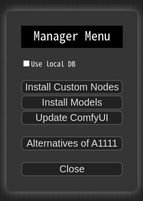

# ComfyUI Manager

# Installation

1. cd custom_nodes
2. git clone https://github.com/ltdrdata/ComfyUI-Manager.git
3. Restart ComfyUI

# Changes
* **0.12** Better installation support for Windows.
* **0.9** Support keyword search in installer menu.
* **V0.7.1** Bug fix for the issue where updates were not being applied on Windows.
  * **For those who have been using versions 0.6, please perform a manual git pull in the custom_nodes/ComfyUI-Manager directory.**
* **V0.7** To address the issue of a slow list refresh, separate the fetch update and update check processes.
* **V0.6** Support extension installation for missing nodes.
* **V0.5** Removed external git program dependencies.


# How To Use

1. Click "Manager" button on main menu


2. If you click on 'Install Custom Nodes' or 'Install Models', an installer dialog will open.


* When the 'Use local DB' feature is enabled, the application will utilize the data stored locally on your device, rather than retrieving node/model information over the internet

* The ```Fetch Updates``` menu retrieves update data for custom nodes locally. Actual updates are applied by clicking the ```Update``` button in the ```Install Custom Nodes``` menu.

3. Click 'Install' or 'Try Install' button.


* Installed: This item is already installed.
* Install: Clicking this button will install the item.
* Try Install: This is a custom node of which installation information cannot be confirmed. Click the button to try installing it.


# Custom node support guide

* Currently, the system operates by cloning the git repository and sequentially installing the dependencies listed in requirements.txt using pip, followed by invoking the install.py script. In the future, we plan to discuss and determine the specifications for supporting custom nodes.

* Please submit a pull request to update either the custom-node-list.json or model-list.json file.

* The scanner currently provides a detection function for missing nodes, which is capable of detecting nodes described by the following two patterns.

```
NODE_CLASS_MAPPINGS = {
    "ExecutionSwitch": ExecutionSwitch,
    "ExecutionBlocker": ExecutionBlocker,
    ...
}

NODE_CLASS_MAPPINGS.update({
    "UniFormer-SemSegPreprocessor": Uniformer_SemSegPreprocessor,
    "SemSegPreprocessor": Uniformer_SemSegPreprocessor,
})
```


# Support of missing nodes installation


* When you click on the ```Install Custom Nodes (missing)``` button in the menu, it displays a list of extension nodes that contain nodes not currently present in the workflow.


* Currently, support is not available for custom nodes that can only be downloaded through civitai.


# TODO: Unconventional form of custom node list

* https://github.com/hlky/AIT
* https://github.com/bmad4ever/ComfyUI-Bmad-Custom-Nodes
* https://github.com/diontimmer/Sample-Diffusion-ComfyUI-Extension
* https://github.com/shadownetdev1/comfyui-addons


# Roadmap

* installation from git url
* 3rd party repository
* category/keyword filter
* Specification of custom nodes
* Specification scanner
* Search extension by node name
* Automatic recognition of missing custom nodes
* Automatic installation suggestion of missing custom nodes
* workflow downloader

# Disclaimer

* This extension simply provides the convenience of installing custom nodes and does not guarantee their proper functioning.
