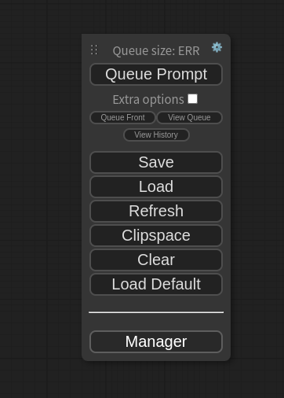
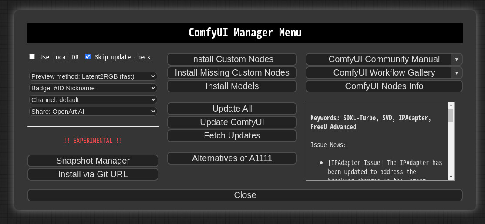
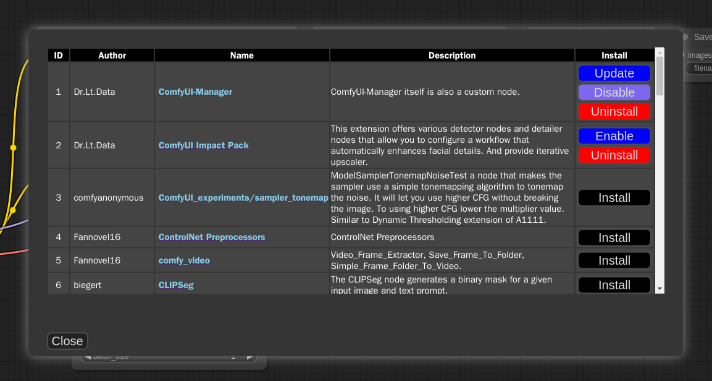
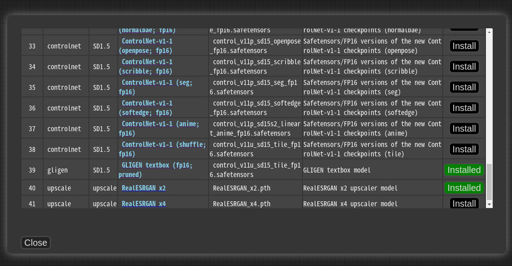
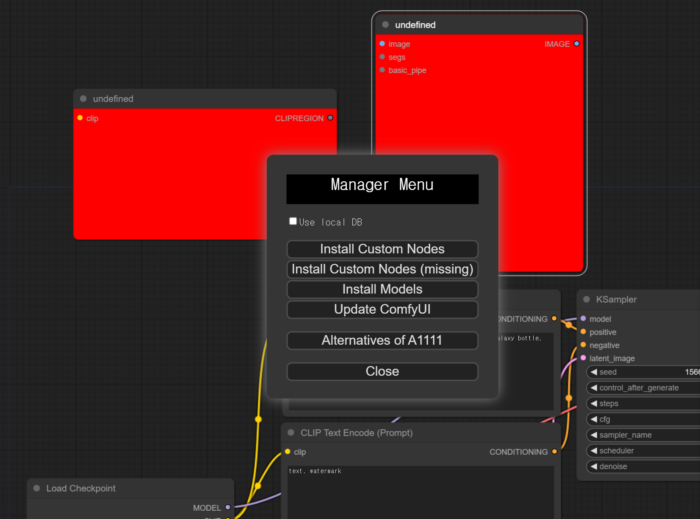
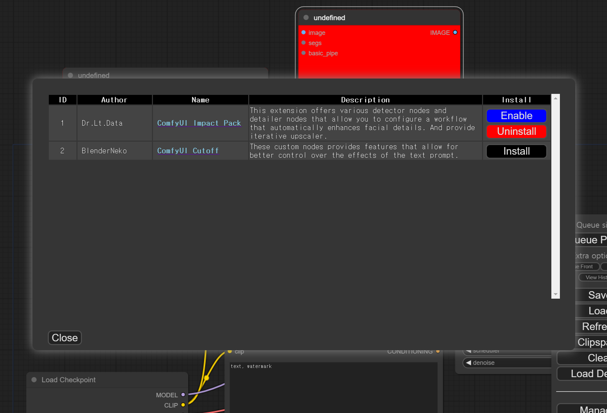

# ComfyUI Manager

## Installation[method1] (General installation method: ComfyUI-Manager only)

To install ComfyUI-Manager in addition to an existing installation of ComfyUI, you can follow the following steps:

1. cd custom_nodes
2. git clone https://github.com/ltdrdata/ComfyUI-Manager.git
3. Restart ComfyUI


## Installation[method2] (Installation for portable ComfyUI version: ComfyUI-Manager only)

1. Download [scripts/install-manager-for-portable-version.bat](https://github.com/ltdrdata/ComfyUI-Manager/raw/main/scripts/install-manager-for-portable-version.bat) into installed `"ComfyUI_windows_portable"` directory
2. double click `install-manager-for-portable-version.bat` batch file


## Installation[method3] (Installation for linux+venv: ComfyUI + ComfyUI-Manager)

To install ComfyUI with ComfyUI-Manager on Linux using a venv environment, you can follow these steps:

1. Download [scripts/install-comfyui-venv-linux.sh](https://github.com/ltdrdata/ComfyUI-Manager/raw/main/scripts/install-comfyui-venv-linux.sh) into empty install directory
- ComfyUI will be installed in the subdirectory of the specified directory, and the directory will contain the generated executable script.
2. `chmod +x install-comfyui-venv-linux.sh`
3. `./install-comfyui-venv-linux.sh`


You can execute ComfyUI by running either `./run_gpu.sh` or `./run_cpu.sh` depending on your system configuration.


# Changes
* **0.17.1** Bug fix for the issue where enable/disable of the web extension was not working.
* **0.17** Support preview method setting feature.
* **0.14** Support robust update.
* **0.13** Support additional 'pip' section for install spec.
* **0.12** Better installation support for Windows.
* **0.9** Support keyword search in installer menu.
* **V0.7.1** Bug fix for the issue where updates were not being applied on Windows.
  * **For those who have been using versions 0.6, please perform a manual git pull in the custom_nodes/ComfyUI-Manager directory.**
* **V0.7** To address the issue of a slow list refresh, separate the fetch update and update check processes.
* **V0.6** Support extension installation for missing nodes.
* **V0.5** Removed external git program dependencies.


# How To Use

1. Click "Manager" button on main menu




2. If you click on 'Install Custom Nodes' or 'Install Models', an installer dialog will open.


* When the 'Use local DB' feature is enabled, the application will utilize the data stored locally on your device, rather than retrieving node/model information over the internet

* The ```Fetch Updates``` menu retrieves update data for custom nodes locally. Actual updates are applied by clicking the ```Update``` button in the ```Install Custom Nodes``` menu.

3. Click 'Install' or 'Try Install' button.





* Installed: This item is already installed.
* Install: Clicking this button will install the item.
* Try Install: This is a custom node of which installation information cannot be confirmed. Click the button to try installing it.


# Custom node support guide

* Currently, the system operates by cloning the git repository and sequentially installing the dependencies listed in requirements.txt using pip, followed by invoking the install.py script. In the future, we plan to discuss and determine the specifications for supporting custom nodes.

* Please submit a pull request to update either the custom-node-list.json or model-list.json file.

* The scanner currently provides a detection function for missing nodes, which is capable of detecting nodes described by the following two patterns.
  * Or you can provide manually `node_list.js` file. 

```
NODE_CLASS_MAPPINGS = {
    "ExecutionSwitch": ExecutionSwitch,
    "ExecutionBlocker": ExecutionBlocker,
    ...
}

NODE_CLASS_MAPPINGS.update({
    "UniFormer-SemSegPreprocessor": Uniformer_SemSegPreprocessor,
    "SemSegPreprocessor": Uniformer_SemSegPreprocessor,
})
```

* **Special purpose files** (optional)
  * `node_list.js` - When your custom nodes pattern of NODE_CLASS_MAPPINGS is not conventional, it is used to manually provide a list of nodes for reference. ([example](https://github.com/melMass/comfy_mtb/raw/main/node_list.json))
  * `requirements.txt` - When installing, this pip requirements will be installed automatically 
  * `install.py` - When installing, it is automatically called
  * `uninstall.py` - When uninstalling, it is automatically called
  * `disable.py` - When disabled, it is automatically called
    * When installing a custom node setup `.js` file, it is recommended to write this script for disabling.
  * `enable.py` - When enabled, it is automatically called


# Support of missing nodes installation



* When you click on the ```Install Missing Custom Nodes``` button in the menu, it displays a list of extension nodes that contain nodes not currently present in the workflow.



* Currently, support is not available for custom nodes that can only be downloaded through civitai.

* [ComfyUI_Custom_Nodes_AlekPet](https://github.com/AlekPet/ComfyUI_Custom_Nodes_AlekPet)


# Troubleshooting
* If updating ComfyUI-Manager itself fails, please go to the **ComfyUI-Manager** directory and execute the command `git update-ref refs/remotes/origin/main a361cc1 && git fetch --all && git pull`.
 * Alternatively, download the update-fix.py script from [update-fix.py](https://github.com/ltdrdata/ComfyUI-Manager/raw/main/scripts/update-fix.py) and place it in the ComfyUI-Manager directory. Then, run it using your Python command.
   For the portable version, use `..\..\..\python_embedded\python.exe update-fix.py`.
* If Controlnet is set to skip_v1 true, nodes like `CannyEdgePreprocessor` will appear as extensions of missing nodes, but simply installing them is not enough, and direct modification of the user's config.yaml is required.
* For cases where nodes like `PreviewTextNode` from `ComfyUI_Custom_Nodes_AlekPet` are only supported as front-end nodes, we currently do not provide missing nodes for them.
* Currently, `vid2vid` is not being updated, causing compatibility issues.


# TODO: Unconventional form of custom node list

* https://github.com/bmad4ever/ComfyUI-Bmad-Custom-Nodes
* https://github.com/diontimmer/Sample-Diffusion-ComfyUI-Extension
* https://github.com/laksjdjf/pfg-ComfyUI
* https://github.com/senshilabs/NINJA-plugin
* https://github.com/failfa-st/comfyui-extensions

# Roadmap

- [x] category/keyword filter
- [x] Automatic recognition of missing custom nodes
- [x] Automatic installation suggestion of missing custom nodes
- [ ] installation from git url 
- [ ] 3rd party repository
- [ ] Specification of custom nodes
- [ ] Specification scanner
- [ ] Search extension by node name
- [ ] workflow downloader


# Disclaimer

* This extension simply provides the convenience of installing custom nodes and does not guarantee their proper functioning.
